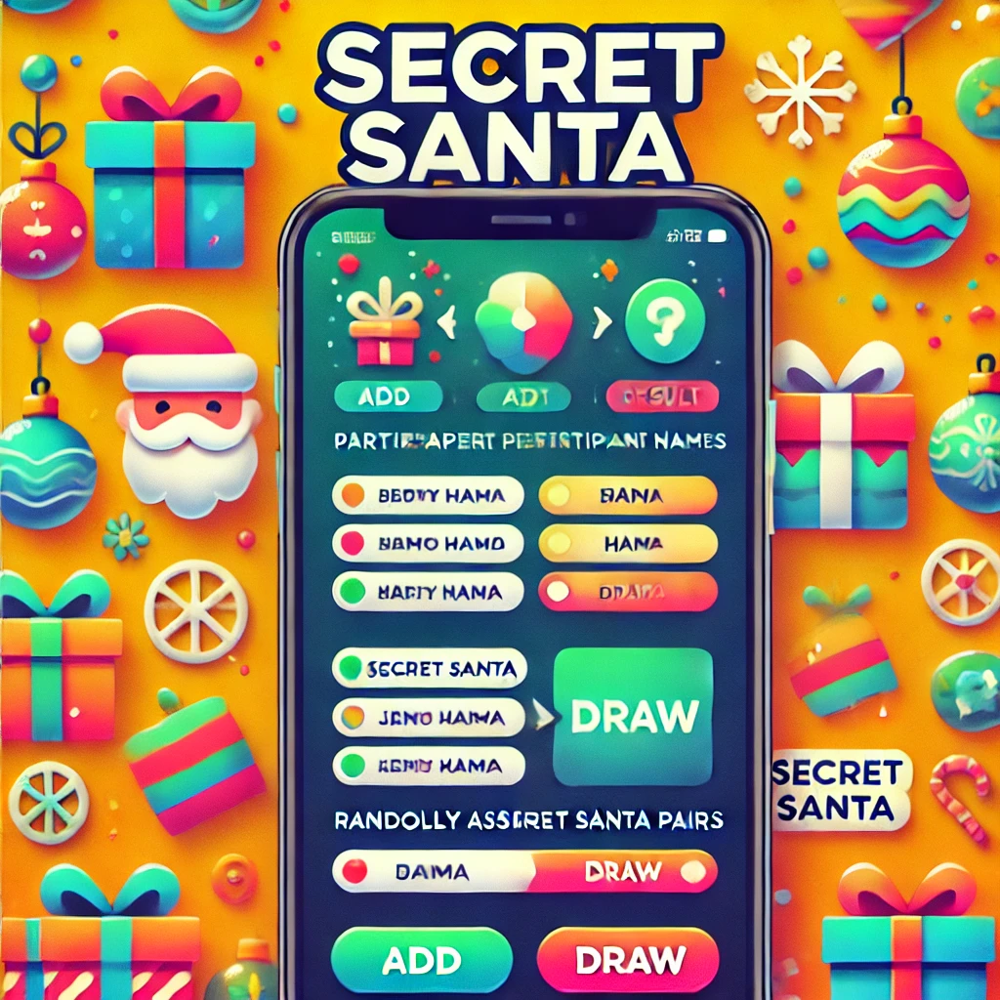

# juego_amigo_secreto

##Índice

*[Título e imagen de portada](#Título-e-imagen-de-portada)
    <h1 align="center"> Amigo Secreto</h1>

*[Insignias](#insignias)

*[Índice](#índice)

*[Descripción del proyecto](#descripción-del-proyecto)
  Este proyecto es parte del desafio del bootcamp de Oracle One version 8
  este desafio consiste en simular el juego del amigo secreto
*[Estado del proyecto](#Estado-del-proyecto)
  terminado
*[Características de la aplicación y demostración](#Características-de-la-aplicación-y-demostración)
 1) Juego del amigo secreto: Este es un tipico juego que realiza en navidad, la idea de este juego 
 es que las personas que visiten el sitio, puedan agregar amigos y despues en un sorteo ramdom, obtener el resultado
 2) ¿Como se Juega? : Muy facil , solo debes ingresar tu nombre e ir agregando amigos
 3) Reglas del Juego = El juego debe tener un minimo de dos amigos, tampoco se puede dejar el campo nombre en blanco
 de lo contrario , se envia un mensaje de error, datos erroneos
*[Acceso al proyecto](#acceso-proyecto)
puedes acceder al proyecto mediante este enlace
[This link](https://gipsy-yuilet-dev.github.io/juego_amigo_secreto/) Amigo Secreto.

*[Tecnologías utilizadas](#tecnologías-utilizadas)
  1. HTML5
  2. CSS
  3. Javascript
*[Personas Contribuyentes](#personas-contribuyentes)
 por el momento no hay personas contribuyentes
*[Personas-Desarrolladores del Proyecto](#personas-desarrolladores)
  Yulieta Eyzaguirre(Julieta Eyzaguirre)
* [Licencia](#licencia)
 none
*[Conclusión](#conclusión)
Este Juego fue un excelente desafio para aprender los fundamentos basicos
de la programacion web con HTML5-CSS y JAVASCRIPT